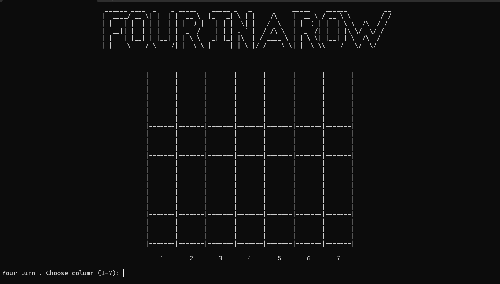

# Four in a Row – AI Game in C

A console-based **Four in a Row** game developed in **C**, featuring Player vs Player and Player vs Computer modes, three AI difficulty levels, Minimax-based decision making, and persistent game statistics.

## Screenshot



## Main Features

- Player vs Player gameplay
- Player vs Computer gameplay
- Three AI difficulty levels: Easy, Medium, and Hard
- Input and move validation
- Horizontal, vertical, and diagonal win detection
- Draw detection when the board is full
- Persistent game statistics saved between sessions
- Console-based visual game board

## AI Difficulty Levels

- **Easy** – selects a random valid move
- **Medium** – searches for an immediate winning move, blocks the player's winning move, and prefers the center column
- **Hard** – uses a depth-limited **Minimax algorithm** with heuristic board evaluation to analyze future moves

## Programming Concepts

The project demonstrates:

- Two-dimensional arrays
- Functions and modular programming
- Structures (`struct`)
- Pointers
- File handling
- Recursion
- Minimax algorithm
- Heuristic board evaluation
- Input validation
- Game-state management

## Project Structure

```text
Main.c
│
├── Board.c / Board.h
│   └── Board initialization, display, menu and screen management
│
├── Game.c / Game.h
│   └── Game logic, win detection and AI strategies
│
└── Stats.c / Stats.h
    └── Game statistics, file saving and loading
```

## Technologies

- C
- Visual Studio
- Windows Console
- Standard C Library
- File I/O

## How to Run

1. Open the `.sln` file in Visual Studio.
2. Build the solution.
3. Run the project.
4. Choose a game mode from the main menu.

## Author

Developed by Gaya Cohen as an academic C programming project.
